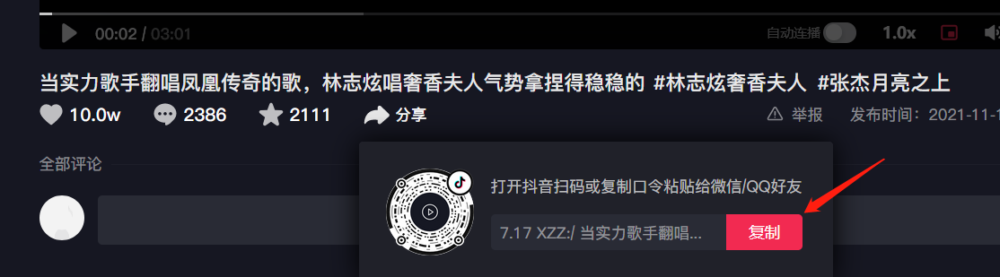
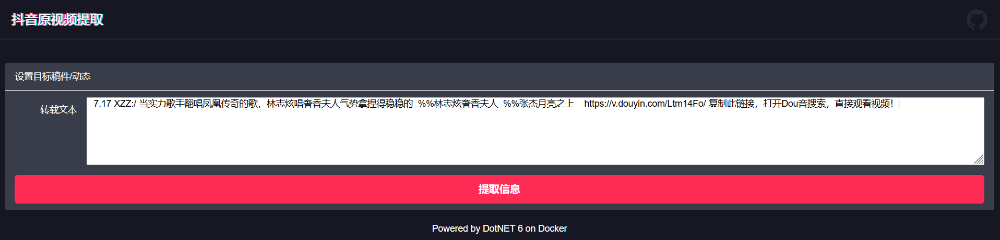
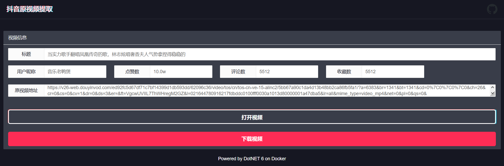

# TikTokDownloader

> To extract origin video URL on Tiktok

## Entrance

https://injectrl.github.io/TikTokDownloader/

## Introduction

My first Dotnet 6 project! And it's about the most popular short video platform Tiktok. As we usually keep watching those interesting short videos, it must be a great shame that unable to download and save them. Although most videos can be downloaded, they still have watermarks. The origin video extracted by this platform is PURE, which means it contains no watermarks.

## Usage

1. Copy Tiktok share code

   

2. Paste share code to first textarea

   

3. Click the button bellow the textarea

   

   In this view, you can check some basic information about this video. What's more, you can open the video to watch or download the video file(.mp4).

## Technology

- Backend WebAPI: DotNet 6.0
- Fontend UI: LayUI 2.5.7

## Deployment of Backend

```shell
docker run -d -it --name {name} -p IP:Port:5000 -e corsTarget={Front-end Domain} injectrl/tiktokdownloader:x.x.x
```

